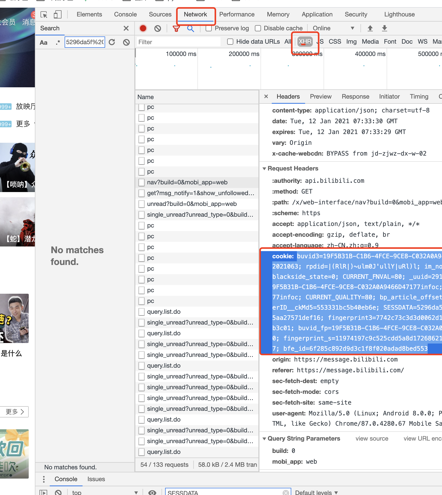

## bilibili获取经验任务，自动投币，直播签到，漫画签到，转发，观看视频

练习项目还在完善中，有些异常没有处理

### 用户参数

+ ~~进入到b站登录并获取到cookie中的三个参数：`SESSDATA`，`bili_jct`，`DedeUserID`~~
- 改为直接复制`cookie`写到setting中`myCookie`不用找这3个参数,省去找的麻烦。
- F12 network -> 随便找个请求 -> 复制请求头cookie

<!-- + 填入到`setting.py`的对应参数下面,内部其他参数已做注释说明 -->
+ 如果有server酱 `SCKEY` 也可以填入 当请求异常会有微信推送。
`server`酱链接：`https://sct.ftqq.com/`

#### ~~本人放在centOS上使用 `crontab` 每日自动跑脚本~~
- 更新支持docker每日任务
- 环境变量配置没做，有空再搞了。
### 说明
- 投币是按关注的up新发的视频,热门排行的视频顺序来
- 分享和观看的视频暂时写死为关注up视频第一个，如果0关注或者关注人没有视频报错还未处理。
